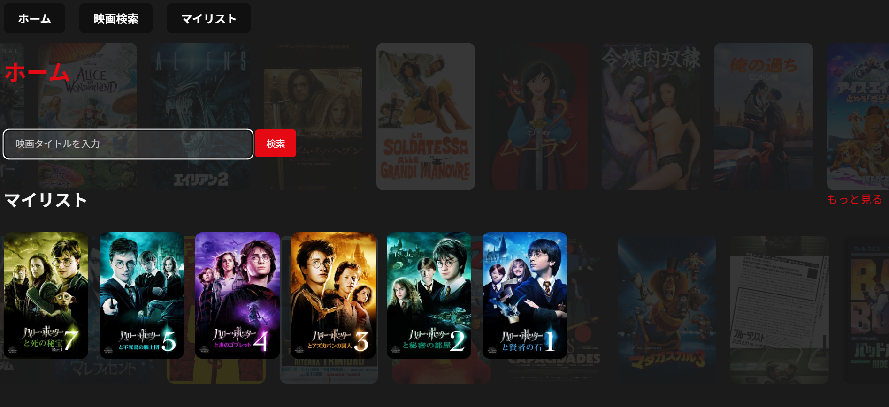
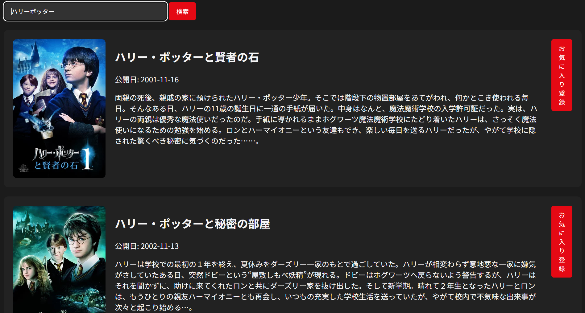
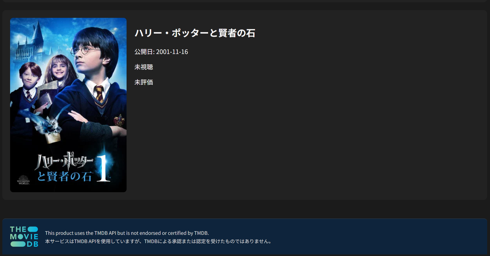

# Movie Manager

TMDB（The Movie Database）のAPIを利用して映画を検索し、気になる作品や視聴記録を管理できるPython製のアプリです。

映画の公開日、視聴状況、5段階評価、感想をSQLiteへ保存できます。ブラウザから操作するWeb版に加え、検索履歴の確認やCSV出力ができるコマンドライン版も用意しています。

## 公開中のWeb版

- 公開URL：https://movie-manager-kv0u.onrender.com

Renderの無料Webサービスへデプロイしています。無料枠を利用しているため、アクセスがない状態から開いた場合は、初回表示まで時間がかかることがあります。

公開環境は、アプリの機能を確認していただくためのポートフォリオ用共通デモです。ユーザーごとのデータ分離には対応しておらず、すべての利用者が同じSQLiteデータを共有します。登録、編集、削除した内容は他の利用者にも反映される可能性があるため、個人情報や重要な内容は入力しないでください。

## 制作背景

幼少期から映画鑑賞が趣味で、映画とPythonの学習を組み合わせた、自分自身が普段使いできるアプリを作りたいと考えたことが制作のきっかけです。

普段、気になる映画を見つけても、作品名や視聴状況、感想などを別々の場所で管理することがありました。そこで、映画の検索からマイリストへの登録、視聴状況の管理、評価、感想の記録までを一つのアプリで行えるようにしました。

映画の検索、ランキング、レビューなどを扱う既存サービスには多くの便利な機能がありますが、本アプリではそれらをそのまま再現するのではなく、自分がよく使う機能を分かりやすくまとめることを重視しています。

## 画面イメージ

### ホーム画面



### 検索結果



### お気に入り



## 制作目的

自分が日常的に使いたい映画管理アプリを形にするとともに、制作を通して次の内容を学ぶことを目的としています。

- TMDB APIを利用した外部サービスとのデータ連携
- Flaskを使ったWebアプリの画面表示と画面遷移
- SQLiteを利用した映画情報や視聴記録の保存
- HTMLとCSSによる、自分の好みに合った画面デザイン
- Web版とコマンドライン版における処理の違い

現在は学習用として基本的な機能を中心に実装しています。今後は検索や記録の使いやすさを改善し、自分が日常的に利用できる「自分専用の映画管理サービス」へ発展させたいと考えています。

## 想定する利用者

- 気になる映画を一か所にまとめておきたい人
- 視聴済み・未視聴の作品を管理したい人
- 観た映画の評価や感想を自分用に記録したい人

利用環境によって、次のように位置付けています。

- **ローカル版：** 自分のパソコン上で、自分専用の映画管理アプリとして利用
- **公開版：** 実装した機能を確認していただくための、ポートフォリオ用共通デモとして利用

## 主な利用の流れ

```text
映画タイトルを検索
        ↓
検索結果から気になる作品を登録
        ↓
マイリストで視聴状況を管理
        ↓
視聴後に5段階評価と感想を記録
```

## 主な機能

### Web版

- 映画タイトルによるTMDB検索
- 検索結果からマイリストへの登録
- 視聴済み・未視聴の管理
- 5段階評価と感想の記録
- 登録済み映画の編集・削除
- レビュー済み映画の一覧表示
- 人気映画のポスターを使ったホーム画面背景

### コマンドライン版

- 映画タイトルによるTMDB検索
- 映画の登録・一覧表示・編集・削除
- 検索履歴の保存と表示
- 登録映画のCSV出力

## 工夫した点

### 検索から記録までを一つにまとめたこと

映画を検索するだけで終わらず、気になった作品の登録、視聴状況の変更、評価、感想の記録までを一つのアプリで行えるようにしました。

### 映画アプリらしさを意識したデザイン

ホーム画面ではTMDBから取得した人気映画のポスターを背景として横方向に流しています。機能を並べるだけではなく、画面を開いたときに映画のアプリだと視覚的に伝わるデザインを目指しました。

### よく使う情報をホーム画面にまとめたこと

ホーム画面からマイリストとレビュー済み作品の一部を確認でき、気になる作品をすぐに開ける構成にしました。

### Web版とコマンドライン版を用意したこと

同じ映画データを異なる操作方法で扱うことで、Pythonの基本的な処理と、Flaskを利用したWebアプリの画面遷移の違いを学べる構成にしました。

### 処理ごとにファイルを分けたこと

Web画面、TMDB APIとの通信、SQLiteの操作を別々のファイルへ分けています。機能ごとの役割を整理し、修正する場所を見つけやすくすることを意識しました。

### 秘密情報をソースコードから分離したこと

TMDB APIキーはソースコードへ直接記述せず、`.env`から読み込む構成にしています。`.env`はGitの管理対象から除外しています。

### TMDBのクレジット要件へ対応したこと

Web版の各画面には、共通テンプレートを使ってTMDBの公式ロゴと指定のクレジットを表示しています。ロゴからTMDB公式サイトを開けるようにし、スマートフォンでも読める表示にしています。

## 制作を通して学んだこと

- APIへ検索条件を送り、JSON形式の結果から必要な情報を取り出す流れ
- Flaskのルーティング、テンプレートへのデータ受け渡し、フォーム処理
- SQLiteを使ったデータの登録・取得・更新・削除
- Web画面で入力された値を検証してから処理する必要性
- `.env`を使ってAPIキーをソースコードから分離する方法
- Gitで公開してよいファイルと、除外すべき秘密情報や個人データの違い
- 共通部品を利用して、複数の画面へ同じ表示を反映する方法

## 学習中の内容とAIの利用について

このアプリは、PythonとWebアプリ開発の学習を目的として制作しました。特にFlaskやSQLiteについては現在も学習中であり、教材に加えて、AIによる支援も活用しながら実装しています。

AIから提案された内容をそのまま使用するのではなく、コードの役割を確認し、自分で説明・修正できる部分を増やすことを今後の課題としています。一方で、アプリの目的、必要な機能、画面構成、デザイン、TMDB APIの選定と取得は、自分で考えて進めました。

## 使用技術

### バックエンド

- Python 3.13
- Flask
- SQLite
- Requests
- python-dotenv
- Gunicorn

### フロントエンド

- HTML
- CSS
- Jinja

### 外部サービス

- TMDB API
- Render

### 開発・管理

- Visual Studio Code
- Git / GitHub

## 画面構成

```text
ホーム
├── 映画検索
├── マイリスト
│   ├── 登録映画一覧
│   ├── レビュー済み映画一覧
│   └── 映画情報の編集
└── 映画の削除
```

## プロジェクト構成

```text
movie-manager/
├── app.py                 # コマンドライン版
├── web_app.py             # Flask Webアプリ
├── movie_api.py           # TMDB APIとの通信
├── database.py            # SQLiteの操作
├── requirements.txt       # Pythonパッケージ一覧
├── .python-version        # Renderで使用するPythonバージョン
├── movies.db              # 映画データ（Git管理対象外）
├── static/
│   └── style.css          # 画面デザイン
├── templates/
│   ├── _tmdb_credit.html  # TMDB共通クレジット
│   ├── home.html          # ホーム画面
│   ├── search.html        # 映画検索画面
│   ├── favorites.html     # マイリスト・レビュー一覧
│   └── edit_movie.html    # 映画編集画面
├── .env                   # TMDB APIキー（Git管理対象外）
└── .gitignore             # Git管理から除外するファイル
```

## セットアップ

### 必要な環境

- Python 3.13
- TMDB APIキー

### 1. プロジェクトフォルダへ移動する

```powershell
cd C:\Users\user\Desktop\movie-manager
```

環境に合わせて、実際にプロジェクトを保存した場所へ変更してください。

### 2. 仮想環境を作成する

```powershell
python -m venv .venv
```

仮想環境を有効にします。

```powershell
.\.venv\Scripts\Activate.ps1
```

### 3. 必要なパッケージをインストールする

```powershell
python -m pip install -r requirements.txt
```

### 4. TMDB APIキーを設定する

プロジェクト直下に`.env`を作成し、取得したTMDB APIキーを設定します。

```env
TMDB_API_KEY=ここにAPIキーを入力
```

`.env`には秘密情報が含まれるため、GitHubへ登録しないでください。

## Web版の起動方法

```powershell
python web_app.py
```

起動後、ブラウザで次のURLを開きます。

```text
http://127.0.0.1:5000
```

## Renderへのデプロイ構成

RenderのWeb Serviceでは、次の内容を設定しています。

| 項目 | 設定値 |
| --- | --- |
| Language | Python 3 |
| Build Command | `pip install -r requirements.txt` |
| Start Command | `gunicorn --bind 0.0.0.0:$PORT web_app:app` |
| Environment Variable | `TMDB_API_KEY` |
| Health Check Path | `/` |

`TMDB_API_KEY`の実際の値はRenderの環境変数として設定し、README、ソースコード、GitHubには記載しません。

## コマンドライン版の起動方法

```powershell
python app.py
```

画面に表示される番号を入力すると、検索、一覧表示、編集、削除、検索履歴の確認、CSV出力ができます。

## データについて

### ローカル版

映画情報と検索履歴は、従来どおりプロジェクト内の`movies.db`へ保存されます。DBファイルを削除すると、保存したデータも失われます。

CSV出力を実行すると、アプリを起動したフォルダへ`favorites.csv`が作成されます。

`.env`、`movies.db`、仮想環境、Pythonのキャッシュは`.gitignore`でGitの管理対象から除外しています。

### Render公開版

公開版では、すべての利用者が同じSQLiteデータを共有します。そのため、他の利用者による登録、編集、削除が全体へ反映される可能性があります。

また、Render無料枠のファイルシステムは永続的な保存先ではないため、サービスの再起動、停止、再デプロイなどによってSQLiteの保存内容が消える場合があります。公開版はデータを長期間保存するサービスではなく、機能確認用の共通デモとして公開しています。

公開デモには、個人情報や消えて困る内容、重要な内容を入力しないでください。

## 現在の課題

- ユーザー認証がなく、公開版では全利用者が同じデータを共有する
- CSRF対策を実装していない
- Render無料枠ではSQLiteのデータが永続化されない
- 同じ映画を登録しようとした場合の案内がない
- マイリストの並び替え・絞り込みに対応していない
- 検索履歴をWeb画面から確認できない
- 自動テストを実装していない
- APIエラーの画面表示やログが十分ではない
- APIのレート制限や短時間の連続操作への対策がない
- スマートフォンでの画面全体の表示に改善の余地がある

これらは将来公開する場合だけの課題ではなく、現在公開している共通デモが持つ制限です。公開版は機能確認を目的として利用してください。

## 今後の改善候補

- ユーザー認証を追加し、利用者ごとにデータを分けて管理する
- CSRF対策を実装する
- PostgreSQLなど、公開環境で永続化できるデータベースへ移行する
- 重複登録時の案内を追加する
- マイリストの並び替え・絞り込みに対応する
- 検索履歴をWeb画面から確認できるようにする
- 自動テストを追加する
- APIエラーの画面表示とログ出力を改善する
- レスポンシブデザインを改善する
- データのバックアップと復元に対応する

## 制作時に参考・利用したもの

- 職業訓練および個人学習で使用したPython、HTML、CSSの教材
- [TMDB公式サイト](https://www.themoviedb.org/)（映画情報の確認とAPIキーの取得）
- ChatGPT（実装方法の調査、コード作成、エラーの確認、READMEの整理）

FlaskやSQLiteについては、AIによる支援を活用しながら実装しており、現在も基礎から学習を進めています。今後、公式ドキュメントや書籍を実際に参照した場合は、内容を説明できるものだけをこの欄へ追加します。

## 注意事項

このアプリは学習およびポートフォリオ用途で制作しています。Renderで公開しているWeb版は、機能確認を目的とした共通デモです。

- 公開版では、すべての利用者が同じデータを共有します
- 登録内容は、他の利用者によって編集または削除される場合があります
- サービスの再起動、停止、再デプロイなどによって保存内容が消える場合があります
- 個人情報、秘密情報、重要な内容、消えて困る内容は入力しないでください

## 開発時の注意事項
- `.env`、TMDB APIキー、ローカルの`movies.db`はGitHubへ登録しないでください

## TMDBクレジット

This product uses the TMDB API but is not endorsed or certified by TMDB.

本アプリはTMDB APIを使用していますが、TMDBによる承認または認定を受けたものではありません。

- [TMDB公式サイト](https://www.themoviedb.org/)
- [TMDBのロゴとクレジット要件](https://www.themoviedb.org/about/logos-attribution)
